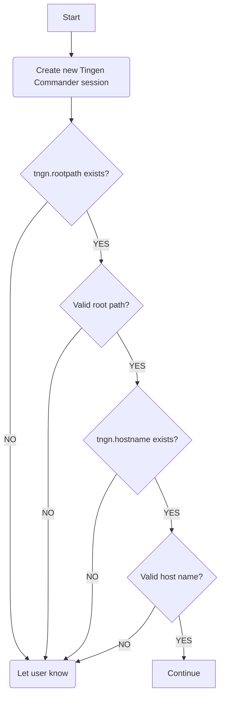

# Tingen Commander Sourceflow (rough)

```mermaid
flowchart TB
  %% Components
  Start
  NewSession("Create new Tingen Commander session")
  GetRootPath{"tngn.rootpath exists?"}
  LetUserKnow("Let user know")
  GetHostName{"tngn.hostname exists?"}
  ValidRootPath{"Valid root path?"}
  ValidHostName{"Valid host name?"}
  %% Layout
  Start --> NewSession --> GetRootPath  
  GetRootPath -- YES --> ValidRootPath
  GetRootPath -- NO --> LetUserKnow
  ValidRootPath -- YES --> GetHostName
  ValidRootPath -- NO --> LetUserKnow
  GetHostName -- NO --> LetUserKnow
  GetHostName -- YES --> ValidHostName
  ValidHostName -- NO --> LetUserKnow
  ValidHostName -- YES --> Continue
```
